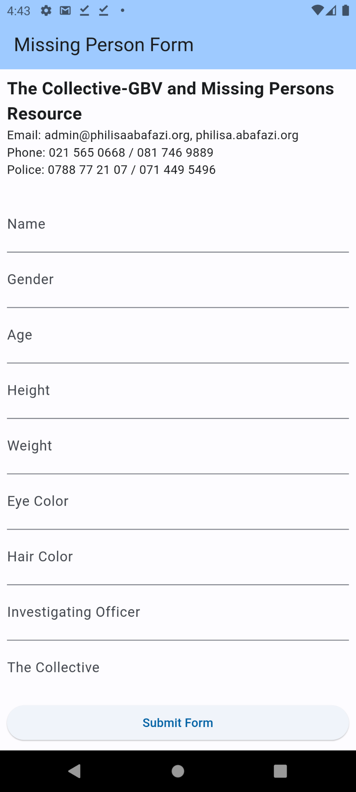
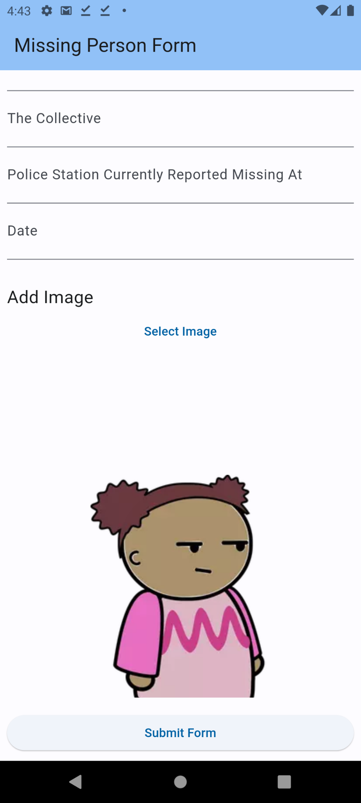
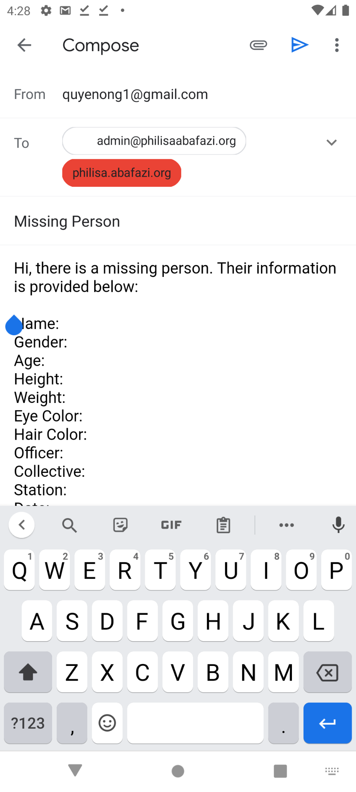
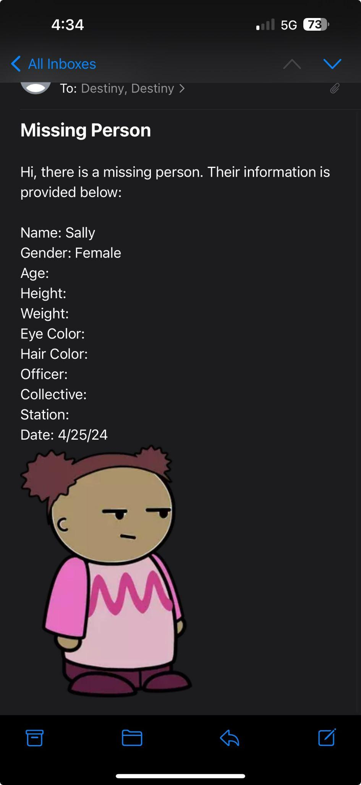

# Missing Persons App

A Flutter mobile app prototype created for the Philisa Abafazi Bethu Centre in Cape Town, South Africa. The app is designed to make missing person reporting simpler by guiding users through a structured form, allowing them to attach a photo, and preparing the report for email submission.

## Screenshots and Demo

### Form Screen

<p align="center">
  
  
</p>

### Email Submission Screen

<p align="center">
  
  
</p>

### Demo Video

[Demo Link](http://drive.google.com/file/d/12FUhnBM2cHdkAHD873REkFBCz7VjfLPY/view)

## Overview

This project was developed as a student collaboration by Destiny Raburnel and Quyen Ong. The goal was to create an accessible mobile tool that could support missing person reporting.

The current prototype focuses on:

- collecting missing person details through a guided form
- attaching an image from the user's photo gallery
- preparing the report for email submission
- displaying organization contact information directly in the app

## Features

- Text fields for key report details including name, gender, age, height, weight, eye color, hair color, investigating officer, collective contact, police station, and date
- Image selection using the device photo gallery
- Preview area that shows a placeholder image until a photo is added
- Email submission through the user's default email flow
- Contact details for the Collective and police contact numbers shown in the interface

## Tech Stack

- Flutter
- Dart
- `image_picker`
- `flutter_email_sender`
- `mailer`
- `url_launcher`

## Project Structure

```text
assets/readme/         Images extracted from the project presentation for README display
lib/
  main.dart            App entry point
  display_form.dart    Main form UI and email/image logic
  images/no_photo.png  Placeholder image
```

## Getting Started

### Prerequisites

Before running the app, make sure you have:

- Flutter SDK installed
- Dart SDK included with Flutter
- An emulator, simulator, or physical device connected

### Install dependencies

```bash
flutter pub get
```

### Run the app

```bash
flutter run
```

## How It Works

1. The app opens to a single missing person form.
2. The user enters the report details.
3. The user selects an image from the gallery.
4. The user taps `Submit Form`.
5. The app opens the email flow with the form details and selected image attached.

## Organization Context

According to the project presentation, this app was created for:

**Philisa Abafazi Bethu Centre**  
Cape Town, South Africa

The form screen also displays the following contact details:

- Email: `admin@philisaabafazi.org`
- Phone: `021 565 0668 / 081 746 9889`
- Police: `0788 77 21 07 / 071 449 5496`

## Team

- Quyen Ong: user input fields and image attachment
- Destiny Raburnel: integration with the user's default email app

## Notes

- This repository is currently a prototype centered around a single main form screen.
- Email behavior depends on the device and platform email configuration.
- The repository includes Flutter platform folders for Android, iOS, web, Windows, Linux, and macOS, while the main application logic lives in `lib/display_form.dart`.

## Future Improvements

- Add form validation for required fields
- Improve recipient configuration and submission reliability
- Support camera capture in addition to gallery upload
- Store reports locally or in a backend service
- Improve accessibility and input formatting